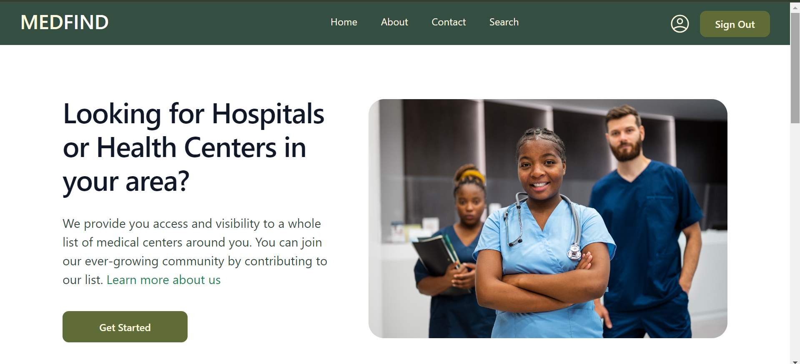

# Altschool Capstone Project

This is a web application solution that allows our users to find hospitals and medical centers around their location, and also allow them to add new entries to our lists.

## Table of contents

- [Overview](#overview)
  - [Project Requirements](#project-requirements)
  - [Pages](#pages)
- [Technology](#process)
  - [Frontend](#frontend)
  - [Backend](#backend)
  - [API](#api)
- [How to run this on your Local PC](#how-to-run-this-on-your-local-pc)

## Overview

### Project Requirements

Users should be able to search, export, share their lists either with email or link sharing functionality and add new centers.

Users can either be Authenticated or Unauthenticated

Authenticated Users can explore all the features

Unauthenticated Users can only search for lists, export and share the link while they have to be authenticated to add new centers or share via email.

### Pages
There are 7 pages implemented on this Project: Home Page, About Page, Contact Page, Search Page, Log In Page, Sign Up Page, Profile Page

### Home Page: 
The home page has a navigation bar, hero section, contents on search and add new centers functionalities, FAQs and footer section.

### About Page: 
This page contains more detailed information about the company and what the web app solution provides.

### Contact Page: 
This page contains a form that our users can use to pass their message/feedback to us

### Search Page: 
The page contains the following functionalities:

Search for any hospital or health center of your choice by name

Search for hospitals or health centers by state

Search for hospitals or health centers by categories

Pagination to move between previous and next page

Export to CSV functionality

Share by Email functionality

Share by Link functionality

### Profile Page: 
This page contains a form that authenticated users can use to add new entries for hospitals or health centers around their location.

### Log In Page: 
This page is where our registered users log in

### Sign Up Page: 
This page is where our prospective users onboards and sign up.

## Technology
### Frontend

React
TypeScript
Bootstrap

### Backend

Firebase

### API

The API implemented on this project is the Humanitarian Data Exchange API on Nigeria Health Facilities that provides the list of hospitals and health centers within Nigeria.

## How to run this on your Local PC:
To run this on your Local PC is pretty straightforward. Execute the following steps:
1. Clone this repo
2. Navigate to the path and run `npm install` on your terminal to install all dependencies
3. Run `npm start` and feel the magic.
