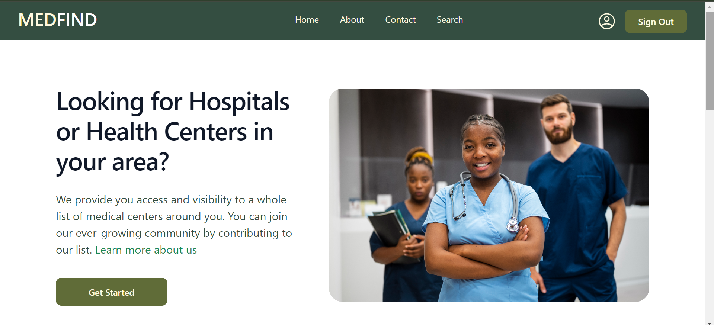

# 🏥 MedFind

**MedFind** is a digital platform that empowers users across Nigeria to **discover, share, and contribute** to a growing database of hospitals and health centers — based on proximity, category, or specific criteria.

Whether you're a patient, caregiver, NGO, or researcher, MedFind simplifies how you access vital healthcare information.

---

## 🔍 Core Features

- **Search** for hospitals and health centers by name, state, or category  
- **Export** search results to CSV for reporting and offline use  
- **Share** results via secure email or public link  
- **Add** new health facilities (authenticated users only)  
- **Responsive interface** accessible across desktop and mobile devices

---

## 👤 Access Levels

| User Type          | Capabilities                                                                 |
|--------------------|------------------------------------------------------------------------------|
| Guest              | Search, Export to CSV, Share via link                                        |
| Authenticated User | All of the above + Add new centers, Share via Email                         |

---

## 🔄 User Flow

1. Users land on the homepage and can immediately start searching.
2. For advanced features like email sharing or submitting new centers, users are prompted to log in or sign up.
3. Upon successful search, users can paginate, export, or share the results.
4. Authenticated users contribute to data accuracy by adding new or missing centers.

---

## 🧭 Navigation Overview

- **Home**: Introduction to MedFind and core call-to-actions  
- **Search**: Access the health center database with filters and actions  
- **Add New Center**: Submit new facilities (authenticated users)  
- **Contact**: Share feedback or inquiries  
- **About**: Learn more about MedFind’s mission and foundation  
- **FAQ**: Common questions answered for users and contributors  

---

## 📊 Data Source

All health facility data on MedFind is sourced from the **[Humanitarian Data Exchange (HDX)](https://data.humdata.org/dataset/nigeria-health-facilities)** under their open data license.  
We thank the HDX team and contributing agencies for their ongoing commitment to transparency and accessibility in global health.

---

## 🔒 Security & Privacy

User authentication is powered by secure backend services. We do not store or share personal user data outside of authentication requirements. Email addresses used for sharing results are not retained.

---

## ⚠️ Limitations

- Email sharing is restricted to results under 50kb (typically 10 pages max) due to third-party service constraints.  
  For larger datasets, please use the **Export to CSV** option.

---

## 💬 Support & Contact

For inquiries, feedback, or support, please visit the [Contact Page](https://med-find.vercel.app/contact) or reach out via email to Taiwo at **taiwoakerele98@gmail.com**.
